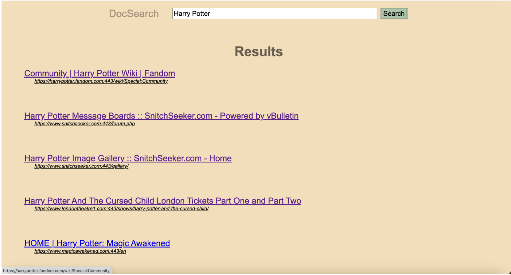

# DocSearch 🔍 
*A full-stack web search engine built from scratch, featuring custom crawling, scalable indexing, PageRank + TF-IDF ranking, and a modern front-end interface.*

---

## 🚀 Overview  
DocSearch is an end-to-end search engine designed to handle large web corpora efficiently. It combines:  
- **Custom crawler** with intelligent filtering and fault tolerance  
- **Scalable indexing** with stemming and frequency tracking  
- **Ranking system** that blends TF-IDF, PageRank, domain scores, and title relevance  
- **Lightweight front-end** with infinite scrolling for a smooth user experience

- ## 🏗️ System Architecture

---

## 🛠️ Tech Stack  
- **Backend:** Java, distributed KVS, AWS EC2  
- **Algorithms:** TF-IDF, PageRank, stemming, ranking heuristics  
- **Frontend:** HTML, CSS, Vanilla JavaScript  
- **Deployment:** AWS EC2, concurrent processing

## 📸 UI

### 🔎 Search Interface  
  
*Main search page with input bar and responsive layout.*

### 📑 Results Page  
  
*Results page with infinite scroll and lazy loading for smooth browsing.*
